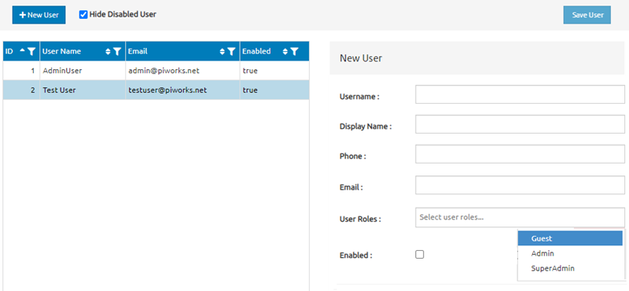

# User Interface Specification
###### v0.01
###### M. Selim Yavuz
###### 2022-12-28

***

##### Contents
1. [Change History](#toc_5)
2. [Open Issues](#toc_6)
3. [Introduction](#toc_7)
4. [Window](#toc_8)
    1. [Layout](#toc_9)
    2. [Description](#toc_10)
5. [Dialogues](#toc_11)

***

##### Change History

Date | Version | Comments
--- | :---: | ---
2022-12-28 | 0.01 | Document created. Draft of specification added.

[
[Top]
](#toc_4)

***

##### Open Issues

Issue ID | Description
--- | ---
N/A |

[
[Top]
](#toc_4)

***

##### Introduction

This document provides the specification for the user interface for Project X. Current version describes the user management view of the administrative interface. 

The specification is comprised of two sections:

- [Window](#toc_8) describes the overall layout of the UI with a sample screenshot and the elements of the UI.
- [Dialogues](#toc_9) describes the interaction of the described UI.

[
[Top]
](#toc_4)

***

##### Window

###### Layout

The layout should look like the following screen. 

###### Description

Section | Element | Label | Description | Constraints | Validation | Default Value | Mandatory for User
--- | --- | --- | --- | --- | --- | --- | --- | ---
Page | | | The page should have a solid white (#FFFFFF) background and should contrast user interaction with a blue palette. 
Menu | 
 | Menu Bar | | The menu bar should have 3 elements with which the user can interact. It should have a light gray background (gray enough to differentiate it from the background of the page).
 | Button | + New User | The button to open the new user form in the main section should be placed at the leftmost position on the menu bar. The label is centered. | 
 | Check Box | Hide Disabled Users | The checkbox should be to the right of the new user button. | | | Unchecked | No
 | Button | Save User | The button to save entered user details should be placed at the rightmost position on the menu bar. The label is centered. |
Main Section |
 | Layout | | The main section should have two columns. |
 | Left column | 
 | User List | | It should be the only main element in the left column. |
 | User List Category Row | ID, User Name, Email, Enabled | This is the categories of the four-column list. Each column should have the option to order the list in descending and ascending order by that column. |
 | Users list | | The list rows should have different-colored backgrounds for even and odd rows. 
 | Right column |
 | New User Form | | It should be the only main element in the right column. Every text should be left-aligned. The labels should be placed to the left of user input elements. |
 | Form Heading | New User | It should give the label with a the same-shade-gray background of the menu bar. |
 | Text box | Username: | Text box username entry. | 30-character text | Alpha-numerical characters with the addition of underscore ([A-Za-z0-9_]) | | Yes
 | Text box | Display Name: | Text box username entry. | 30-character text | UTF-8 letters and clicks (for Khoisan languages) | | Yes
 | Text box | Phone: | Text box username entry. | 16-character text | ITU-T E.123 International Notation | | Yes
 | Text box | Email: | Text box username entry. | 30-character text | ITU-T E.123 Notation for electronic mail addresses | | Yes
 | Dropdown menu | User roles: | Dropdown menu for user role selection. | Guest, Admin, SuperAdmin | | Select user roles... | Yes
 | Check box | Enabled: | Checkbox to enable the user. | | | Unchecked | Yes

[
[Top]
](#toc_4)
***

##### Dialogues
All interaction should happen on the same page. There should be no pop-up dialogues on that page. The page should renew to reflect the changes. 
[
[Top]
](#toc_4)

***

End of Document
